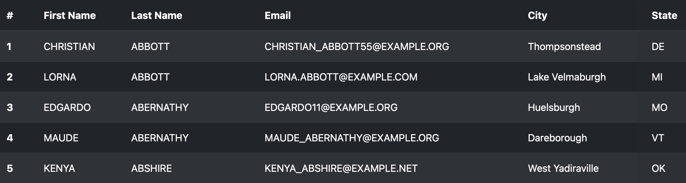

# Constituency API

Elected official's constituency (c10y) data API.

## Dependencies

* Install [Docker](https://docs.docker.com/get-docker/)
* Install [`make`](https://www.gnu.org/software/make/manual/make.html)

## Quick Start

Build the project:
```
make build
```

Run the app:
```
make run
```

Get a shell:
```
make shell
```

## Endpoints

Application is available at http://localhost:8000

### Index

List of all constituents displayed in a basic table, sorted alphabetically.



### List Constituents

JSON API endpoint returning a list of constituents sorted alphabetically.

Request:
```
GET /constituents
```

Response: `200 OK`
```json
{
  "count": 500,
  "constituents": [
    {
      "first_name": "OLIVER",
      "last_name": "DOG",
      "email": "OLLIE@EXAMPLE.COM",
      "city": "San Luis Obispo",
      "state": "CA"
    },
    ...
  ]
}
```

### Health Check

Request:
```
GET /health
```

Response: `200 OK`
```
OK
```

## Resources

* [Poetry](https://python-poetry.org) - Python dependency management
* [Starlette](https://www.starlette.io) - Fast async Python web framework
* [Sqlalchemy](https://docs.sqlalchemy.org/en/20/) - Python database ORM
* [Jinja2](https://jinja.palletsprojects.com/en/3.1.x/) - Server-side template engine
